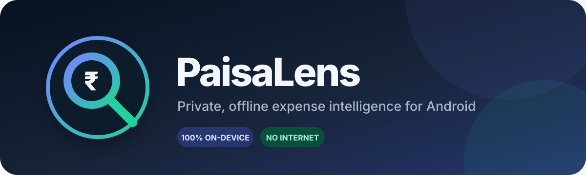
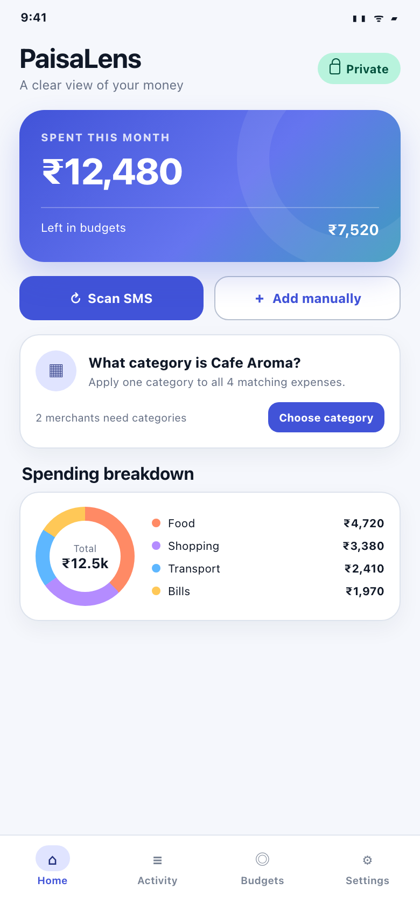
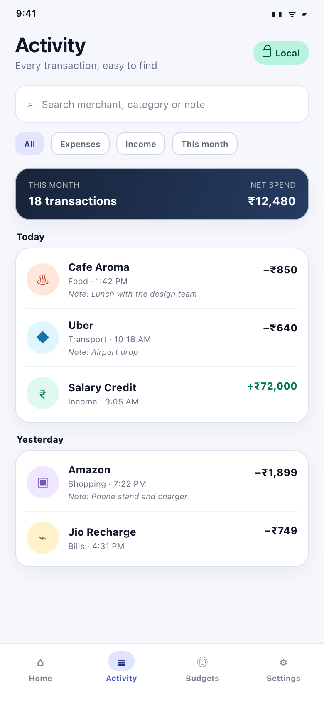
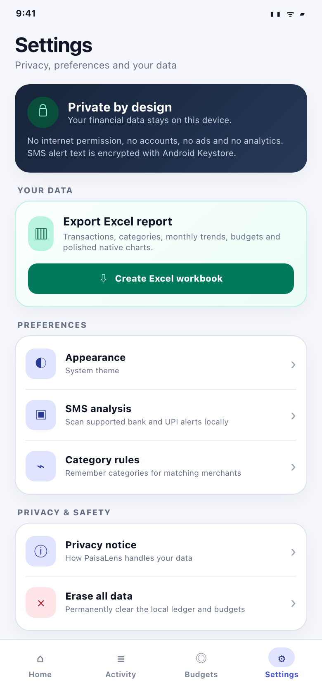
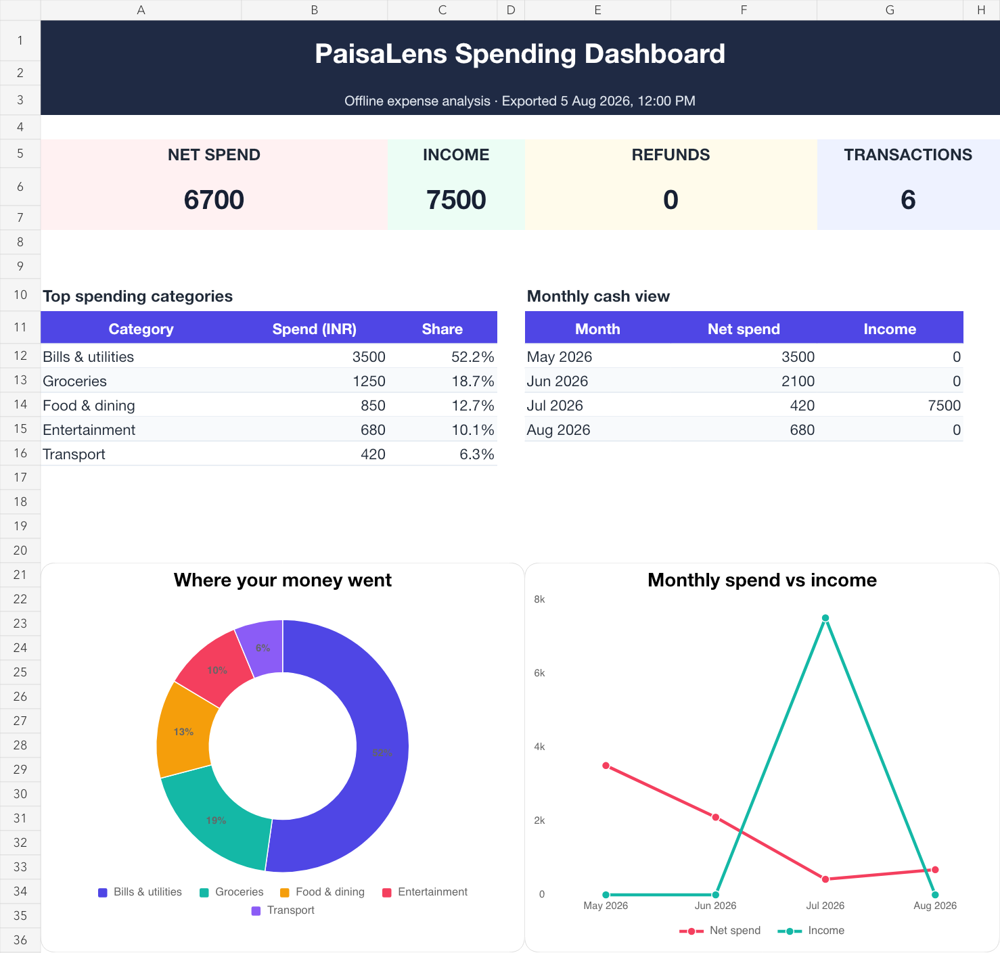

<p align="center">
  
</p>

<p align="center">
  <a href="https://github.com/RohitSiga95/PaisaLens/releases/tag/v1.8.0"></a>
  
  
  
  
</p>

<p align="center">
  A private Android expense tracker for Indian bank, credit-card, wallet and UPI alerts.<br>
  Your SMS and financial data are processed entirely on your phone.
</p>

<p align="center">
  <a href="https://github.com/RohitSiga95/PaisaLens/releases/download/v1.8.0/PaisaLens-v1.8.0-debug.apk"><strong>⬇ Download PaisaLens v1.8.0 APK</strong></a>
  &nbsp;·&nbsp;
  <a href="https://github.com/RohitSiga95/PaisaLens/releases/tag/v1.8.0">View release notes</a>
  &nbsp;·&nbsp;
  <a href="PRIVACY.md">Privacy notice</a>
</p>

> [!IMPORTANT]
> The downloadable file is the current **debug APK** for direct installation and testing. Android may ask you to allow installation from your browser or file manager. Requires Android 8.0 (API 26) or newer.

## See PaisaLens in action

<table>
  <tr>
    <td align="center"><strong>Dashboard &amp; merchant grouping</strong></td>
    <td align="center"><strong>Searchable activity &amp; notes</strong></td>
    <td align="center"><strong>Private Excel export</strong></td>
  </tr>
  <tr>
    <td></td>
    <td></td>
    <td></td>
  </tr>
</table>

<sub>Preview screens mirror the current Compose interface; the example transactions and totals are sample data.</sub>

## Your spending, made understandable

| | Feature | What it does |
|---|---|---|
| 🔎 | **Local SMS detection** | Finds debits, credits, refunds, card purchases, ATM withdrawals, UPI and wallet alerts without uploading messages. |
| 🏷️ | **Merchant category rules** | Groups matching merchants, shows their spending history and trend, asks you once for the category, updates their existing expenses and remembers the answer. |
| 📝 | **Expense notes** | Adds a specific note to a deducted transaction and shows it beneath the item in recent activity and search results. |
| 📊 | **Focused Home dashboard** | Moves month by month with arrow navigation and updates the spend summary, overview, category breakdown, daily chart, and expense list together. |
| 🧱 | **Customisable Home** | Shows, hides, and reorders seven private dashboard modules—including balances, goals, and upcoming commitments—with the layout stored only on the device. |
| 🎯 | **Category budgets** | Tracks limits with progress and overspend states. |
| 📗 | **Beautiful Excel export** | Creates a categorized, link-aware workbook with recorded and analysis amounts, trends, budgets, dashboard cards and native charts. |
| 🏦 | **Accounts & cards** | Organizes transactions into bank accounts, credit cards, wallets, cash, or custom account profiles. |
| 💳 | **Balances & available credit** | Reads transaction and daily HDFC available-balance alerts, combines duplicate SMS profiles by account last-four digits, uses textured bank-colored tiles, and hides unfetched accounts in a collapsed section. |
| 🔁 | **Recurring payments** | Detects consistent weekly and monthly expenses and estimates the next due date. |
| 👥 | **Split expenses & reimbursements** | Allocates a deducted expense across participants, tracks partial repayments, optionally links an incoming refund or income row, and keeps linked reimbursements from inflating analytics. |
| 🐷 | **Savings goals & sinking funds** | Tracks targets, money already saved, dated contributions, progress, remaining amount, and the monthly pace needed to reach an optional target date. |
| 🔄 | **Subscriptions & UPI AutoPay centre** | Manages recurring charges and mandate limits, pause/cancel states, accounts, due dates, and reviewed on-device suggestions without contacting a bank or UPI app. |
| 🧩 | **Colorful categories & tags** | Uses meaningful category colors and icons, creates personal categories directly from any category picker, and adds searchable tags. |
| ✅ | **Review inbox** | Holds uncertain merchant or category matches for confirmation before they affect analytics. |
| 🔐 | **Encrypted backup & restore** | Creates a password-protected portable backup locally and restores it when needed. |
| ✍️ | **Manual entry & bill OCR** | Records an expense, income, refund, or transfer, or prefills the form from a photographed/uploaded bill using a bundled on-device OCR model. |
| 🎨 | **Theme Studio** | Customizes the full app and home-screen widget with Material, AMOLED pure black, or layered gradients; System/Light/Dark appearance; and 14 accessible color variations. |
| 🧹 | **Merchant cleanup** | Renames or merges inconsistent merchants and applies the cleanup rule to future SMS and statement imports. |
| 🏠 | **Home-screen widget** | Shows a privacy-aware monthly glance, with amounts hidden by default and whenever App lock is active. |
| 🔔 | **Private notification digest** | Optionally delivers a daily or weekly on-device summary; amounts are hidden by default and the lock-screen public version is always generic. |
| 🔒 | **App lock** | Uses Android's system fingerprint, face, PIN, pattern, or password prompt to protect the ledger. |
| 📥 | **Statement import** | Previews and imports common CSV and XLSX bank statements locally with duplicate protection. |
| 📈 | **Better analytics** | Adds six-month trends, projections, top merchants, category rankings, and exact-value summaries. |
| 📅 | **Calendar view** | Browses confirmed expenses day by day and opens the underlying transactions. |
| 🏦 | **EMI & loan tracker** | Calculates reducing-balance EMI, tracks paid installments, progress, and next due dates. |
| ✈️ | **Travel mode** | Stores original foreign amounts and converts them with an explicitly refreshed HTTPS reference rate. |
| ✨ | **On-device insights** | Detects possible duplicates, unusual charges, price increases, spending pace, and concentration without uploading data. |
| 📉 | **Balance history** | Saves each distinct bank-balance and available-credit SMS snapshot and shows accessible 7-day, 30-day, 3-month, or all-time trends. |
| 💳 | **Credit utilisation tracker** | Combines the real available credit with a detected or manually entered total limit, then highlights healthy, moderate, high, and critical usage. |
| 🗓️ | **Bills & due-date centre** | Brings manual reminders, locally detected recurring payments, and loan EMIs into one overdue and upcoming timeline. |
| 🔮 | **Cash-flow forecast** | Projects 30, 60, or 90 days from known bank balances, recent income/spending pace, scheduled bills, and EMIs, with assumptions shown beside the chart. |
| 🧮 | **Net-worth dashboard** | Combines known account balances, utilised card credit, amortised loan principal, and manually added assets or liabilities. |
| ⚙️ | **Smart category rules** | Applies prioritized merchant, amount, and account conditions to future expenses, with a preview and optional historical update. |
| 🧪 | **What-if simulator** | Compares baseline and scenario cash positions for income changes, flexible-spend reductions, and one-time purchases without changing real data. |
| 🧾 | **Monthly reconciliation** | Compares an account's confirmed activity with reviewed opening and closing balances, surfaces the exact difference, and saves a month as balanced or reconciled. |
| 🔗 | **Transaction linking** | Suggests likely transfers, card payments, refunds, reversals, and reimbursements by amount, date, account and flow, then prevents confirmed links from inflating dashboards, budgets, forecasts, the widget, or Excel analysis. |
| 🕵️ | **Credit-card statement auditor** | Audits reviewed CSV/XLSX statement rows against locally detected SMS transactions, separates purchases, fees, interest, GST, refunds and payments, and flags missing or duplicate charges. |
| 🩺 | **Data Health Centre** | Brings review backlog, uncategorized spending, stale balances, reconciliation differences, unlinked transfers, scan freshness, and backup readiness into one private health check. |
| ↩️ | **Audit history & undo** | Records supported ledger, link, and reconciliation changes in an on-device history and safely reverses eligible batches. |
| 🛡️ | **Backup verification** | Opens an encrypted `.plbk` backup read-only to verify its password, authenticated contents, format, checksum, and protected record counts without restoring it. |

### Excel reports that are ready to explore

The workbook is generated entirely offline and saved only where you choose through Android's system file picker.

<p align="center">
  
</p>

## Private by design

```text
SMS / statement  →  on-device parser  →  encrypted local ledger  →  dashboard / Excel export
          │                │                       │              ↘ encrypted manual backup
          └──── local statement audit             ├──── reconciliation / undo / health checks
                                                  └──── optional private notification digest
currency pair only  →  HTTPS reference-rate API  →  cached rate ↗
                                       ✕ no account
                                       ✕ no telemetry
                                       ✕ no financial-data upload
```

- No account, ads, third-party analytics, telemetry or cloud SDKs.
- `INTERNET` is used only after the user taps a Travel-mode rate refresh; the HTTPS request contains only the currency pair.
- SMS, receipt images and OCR, statements, transactions, balances, merchants, loans, categories, notes, tags, budgets, participant shares, savings goals, payment commitments, and insights stay on the device.
- Account refresh opens a prefilled system SMS composer; PaisaLens never sends an SMS automatically and requests no `SEND_SMS` permission.
- Automatic cloud backup and device-transfer backup are disabled.
- Optional manual backups are encrypted on-device with a user passphrase, exclude raw SMS text, and are saved only where the user chooses.
- SMS is read only after explicit permission and disclosure.
- OTPs, verification codes, reminders, statements and collect requests are ignored.
- Stored SMS alert text is encrypted with AES-GCM using a non-exportable Android Keystore key.
- Transactions, notes, account profiles, balance history, bills, net-worth items, custom categories, tags, smart rules, cleanup aliases, loans, reconciliation records, transaction links, expense splits, savings contributions, subscription/AutoPay records, audit events, and cached rates use app-private platform SQLite storage.
- **Erase all** clears the local PaisaLens ledger and organization data without changing the phone's SMS inbox or previously exported files.

Read the complete [plain-language privacy notice](PRIVACY.md).

## Download and install

1. Download **[PaisaLens-v1.8.0-debug.apk](https://github.com/RohitSiga95/PaisaLens/releases/download/v1.8.0/PaisaLens-v1.8.0-debug.apk)** on your Android phone.
2. Open the downloaded file.
3. If Android prompts you, allow your browser or file manager to install unknown apps.
4. Choose **Install**, then open PaisaLens and review the SMS disclosure before granting access.

You can also browse the [v1.8.0 release page](https://github.com/RohitSiga95/PaisaLens/releases/tag/v1.8.0).

**APK SHA-256**

```text
f3129e3eaa1370b24401f17f8935c3331d6f548735ca1d4ee39063f5807b70e2
```

## Build it yourself

Requirements: JDK 17, Android SDK Platform 36 and Android SDK Build Tools 35 or newer.

```bash
./gradlew testDebugUnitTest lintDebug assembleDebug
```

The generated v1.8.0 APK will be available at:

```text
app/build/outputs/apk/debug/app-debug.apk
```

Install it on a USB-connected Android device with:

```bash
adb install -r app/build/outputs/apk/debug/app-debug.apk
```

<details>
<summary><strong>Project structure</strong></summary>

```text
app/src/main/java/com/paisalens/app/
├── data/
│   ├── local/          # SQLite and preferences
│   ├── model/          # Transaction and budget models
│   ├── parser/         # Bank, card and UPI SMS parser
│   ├── importer/       # Local CSV/XLSX statement import
│   ├── network/        # Explicit HTTPS reference-rate refresh only
│   ├── backup/         # Password-protected portable backups
│   ├── export/         # Offline Excel workbook generation
│   └── repository/     # Local data coordination
├── security/           # Android Keystore AES-GCM
├── sms/                # Inbox scanner and incoming SMS receiver
├── widget/             # Privacy-aware Android home-screen widget
└── ui/                 # Compose theme, components and screens
```

</details>

## SMS permission and Play distribution

`READ_SMS` and `RECEIVE_SMS` are restricted Google Play permissions. SMS-based money management is listed as an eligible exception, but public Play distribution still requires a Permissions Declaration, prominent disclosure, consent, a privacy policy and Google Play review. A directly installed APK does not go through Play review, but PaisaLens intentionally keeps the runtime permission and disclosure.

[Read Google's SMS and Call Log permission policy](https://support.google.com/googleplay/android-developer/answer/10208820).

## Accuracy note

Banks and payment providers use many SMS formats. PaisaLens uses deterministic on-device rules and covers common Indian formats, but you should still verify detected transactions and recategorize them when needed. PaisaLens never initiates payments or accesses a bank account.

---

<p align="center">
  <strong>PaisaLens</strong> · Your money stays yours.
</p>
